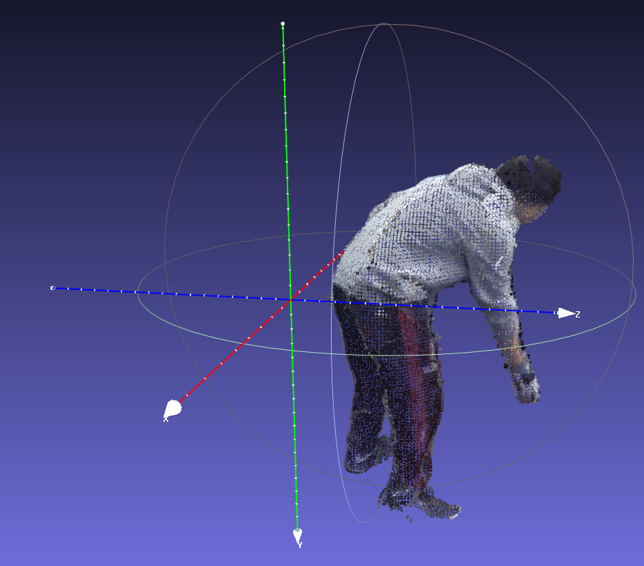

# fast-human-reg
A library for fast human registration. It achieves a speed of **0.2s/example** with bs=1, and can be 10 times faster if you batchfy it!

The pipeline is based on a feedforward autoencoder ([CorrAE](https://virtualhumans.mpi-inf.mpg.de/InterTrack/)) and [fast SMPL fitter](https://github.com/isarandi/smplfitter).


## Dependency
The code is tested on `torch=1.12.1+cu121, cuda12.1, debian11`. We recommend using conda environment:
```shell
conda create -n fast-reg python=3.8
conda activate fast-reg 
```
Required packages can be installed by:
```shell
pip install -r pre-requirements.txt # Install pytorch and other dependencies 
```

SMPL body model, please download SMPL family models following [this instruction](https://github.com/isarandi/smplfitter/blob/main/README.md#download-body-model-files).

## Example Usage
```shell
python demo.py dataset.file=$PWD/data/demo-kinect-pc.ply dataset.smpl_root=<your_smpl_model_root>
```
Note that the model is trained with the [ProciGen](https://virtualhumans.mpi-inf.mpg.de/procigen-hdm/) dataset, hence the human (head to foot vector) aligns with the +y axis, see the figure of the demo point cloud below. 
If your data has a different head orientation, please rotate them before doing registration. 
<p align="left">

</p>

## Citation
If you use our code, please cite:
```
@inproceedings{xie2024InterTrack,
    title = {InterTrack: Tracking Human Object Interaction without Object Templates},
    author = {Xie, Xianghui and Lenssen, Jan Eric and Pons-Moll, Gerard},
    booktitle = {International Conference on 3D Vision (3DV)},
    month = {March},
    year = {2025},
}

@article{sarandi24nlf,
    title = {Neural Localizer Fields for Continuous 3D Human Pose and Shape Estimation},
    author = {Sárándi, István and Pons-Moll, Gerard},
    journal = {Advances in Neural Information Processing Systems (NeurIPS)},
    year = {2024},
}
```
